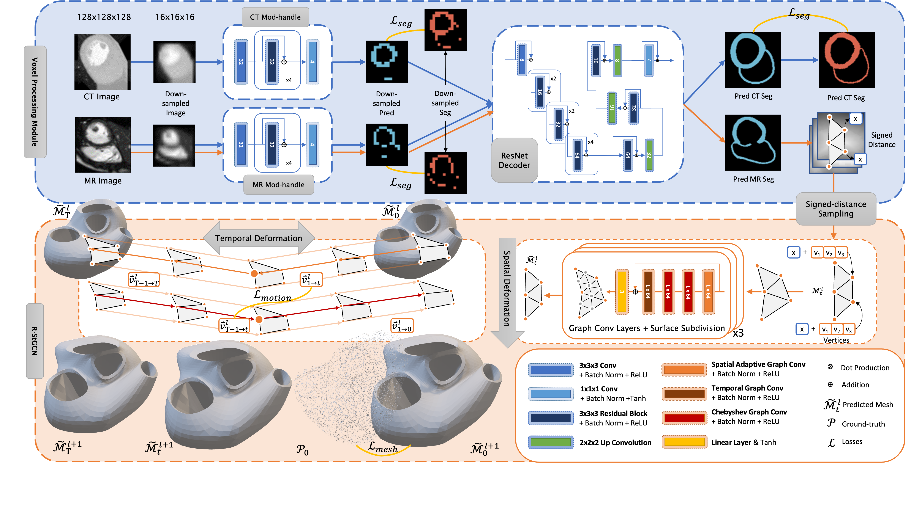
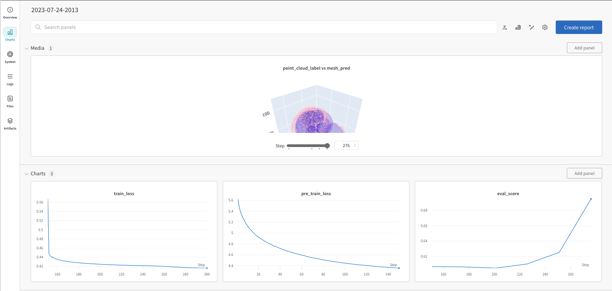

# Introduction
This repository includes scripts and tools running code for paper, ModusGraph: Automated 3D and 4D Mesh Model Reconstruction from cine CMR with Improved Accuracy and Efficiency [URL]. Sole purpose of this repository is to provide a reference for the paper. The code is not optimized for efficiency and not guaranteed to be bug-free. The code is written in Python 3.9.16 and Pytorch 1.12.1.



# Installation
The code is tested on Ubuntu 18.04.6 LTS. To install the code, first clone the repository:

    $ git clone https://github.com/MalikTeng/ModusGraph
    
    Then install the conda environment:
    $ conda env create -f environment.yml
    
    Then activate the environment:
    $ conda activate modusgraph

# Usage
## Data
The data used in the paper is not included in this repository. The data is available upon request, and details provided in the paper. The data is organized in the following structure:
```
data
├── imagesTr
│   ├── 1.nii.gz
│   ├── 2.nii.gz
│   ├── ...
│   └── 100.nii.gz
├── labelsTr
│   ├── 1.nii.gz
│   ├── 2.nii.gz
│   ├── ...
│   └── 100.nii.gz
```
Template meshes were needed for runing the code. The template meshes are included for reference. The template meshes are organized in the following structure:
```
template
|── scotheart
|   ├── 1.obj
|   ├── 2.obj
|   ├── ...
|   └── 6.obj
|── cap
|   ├── 1.obj
```

## Preprocessing
Data preprocessing is a must so that images, segmentations, and template meshes are in the same space. While ways to conduct such a preprocessing are not included in this script, the result can be varified by the script 'data_test_XXXX.py'. 

## Training
### Whole heart meshing (i.e., SCOT-HEART)
The training process contains two stages:
1. Pre-training: train the Voxel Processing Module, including CT modality handel and ResNet decoder.
2. Training: train the R-StGCN module.
Detail structure of ModusGraph can be found in the paper.

Parameters of the network is customizable but not recommended.

We recommand using Weights and Bias for monitoring the training process. Following snapshot shows the training process of the two training stages.


### Dynamic meshing (i.e., CAP)
under construction

## TL;DR
Running the whole training process is straightforward, just use commandline tool, e.g.:

    $ python main-whole_heart_meshing.py \

    --image_dir /path/to/image \
    --label_dir /path/to/label \
    --log_dir /path/to/log_dir \
    --out_dir /path/to/out_dir \

    --max_epochs 500 \
    --delay_epochs 0 \
    --val_interval 50 \

    --crop_window_size 128 128 128 \
    --batch_size 24 \
    --point_limit 53_500 \

    --cache_rate 1.0

See details of adjustable parameters in the script.

Running the dynamic meshing process is ... (under construction) 
